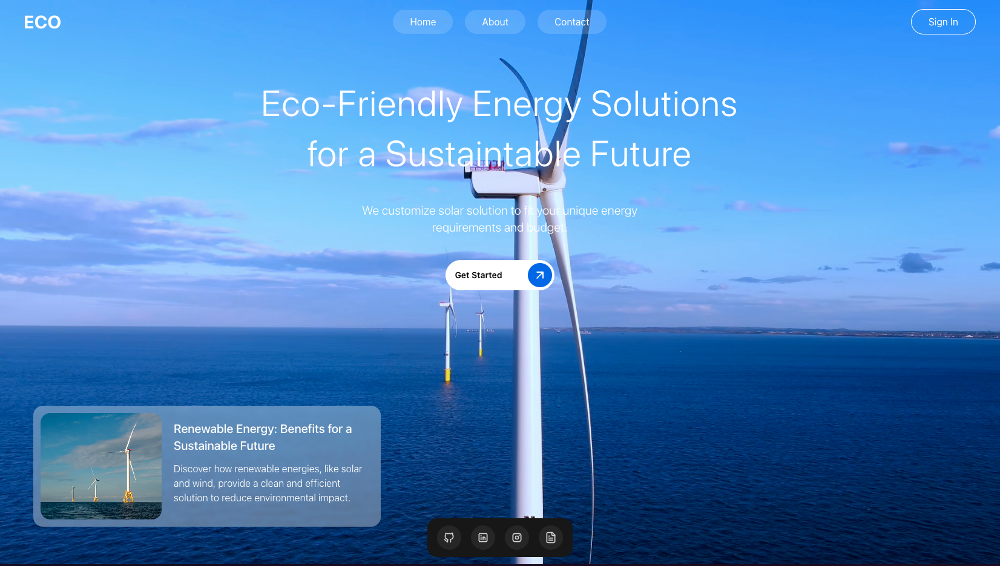

# ECO SITE

> Site sobre energia renovavel feito em React e NextJS

### Ajustes e melhorias

O projeto ainda está em desenvolvimento e as próximas atualizações serão voltadas para as seguintes tarefas:

- [ ] Responsividade
- [ ] Pagina Sobre nós
